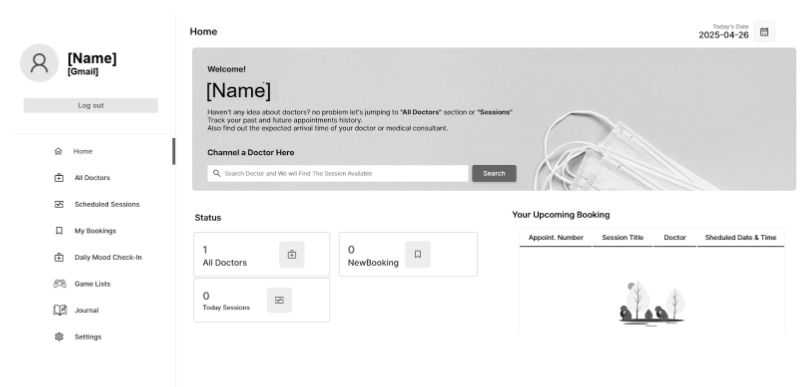
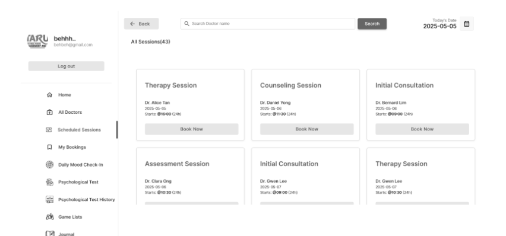
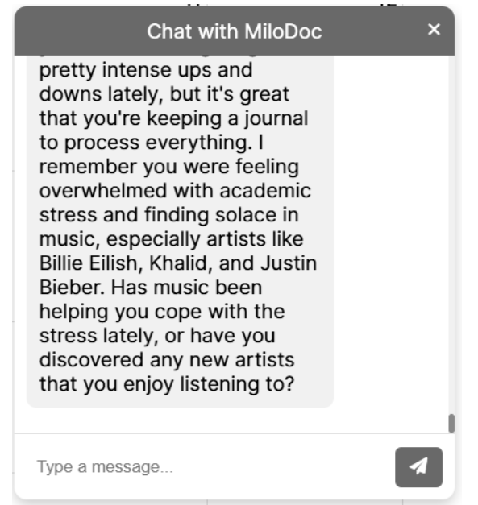
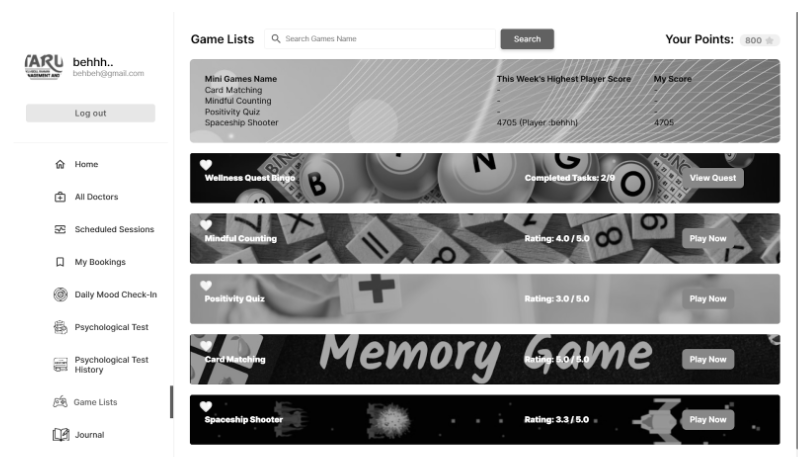
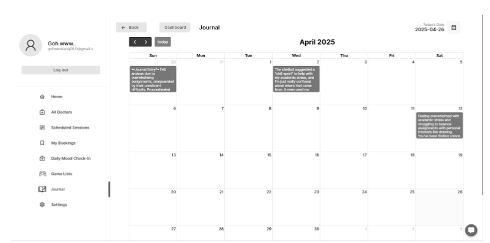
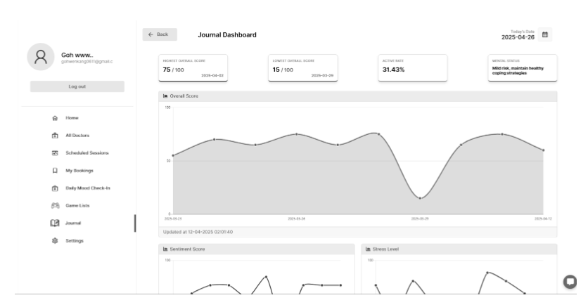
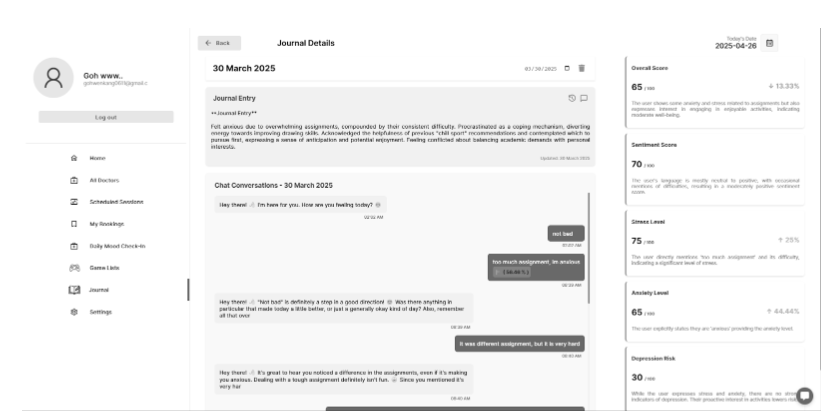
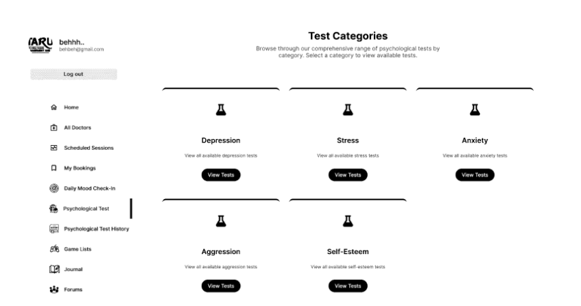
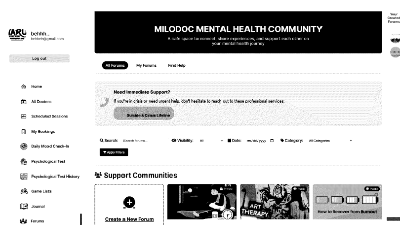

# MiloDoc Project

MiloDoc is a comprehensive web application designed to provide various mental health support features, including consultation booking, a chatbot, mini-games, daily mood check-ins, psychological tests, and a community forum.

## Features

*   **Booking Consultation:** Schedule appointments with doctors.
*   **Chatbot:** An AI-powered chatbot for interactive support.
*   **Mini-Games:** Engaging mini-games for stress relief and mental well-being.
*   **Daily Mood Check-in:** Track and record your daily mood.
*   **Psychological Test:** Access and complete psychological assessments.
*   **Community Forum:** Connect with others, share experiences, and find support.

## Setup Instructions

1.  **Extract the project zip file:** Extract `RSWG3_BehJingHen_App.zip`.
2.  **Import SQL Database:**
    *   Navigate into the extracted `app` folder.
    *   Import the `mdoc_database.sql` file into your database management system (e.g., phpMyAdmin, MySQL Workbench).
3.  **Open with VS Code:** Right-click the `app` folder and select "Open with Code".

### Chatbot Model & Suicidal Detection Setup

1.  Open your terminal in VS Code.
2.  Navigate to the `chatbot_model_api` directory:
    ```bash
    cd chatbot_model_api
    ```
3.  Create a virtual environment:
    ```bash
    python -m venv venv
    ```
4.  Activate the virtual environment:
    ```bash
    venv/Scripts/activate
    ```
5.  Install required libraries:
    ```bash
    pip install -r requirements.txt
    ```
6.  Start the chatbot model API and suicidal detection server (on port 8001):
    ```bash
    uvicorn app_llama:app --reload --port 8001
    ```

### Website Setup

1.  Open a new terminal in VS Code.
2.  Navigate to the `website` directory and run the PHP development server (on port 8000):
    ```bash
    cd website
    php -S localhost:8000
    ```

## Login Credentials

### Admin Login
*   **Username:** `admin@mdoc.com`
*   **Password:** `Beh@030118`

### Doctor Login
*   **Username:** `doctorlim0000@gmail.com`
*   **Password:** `Beh@030118`

### Patient Login
*   **Username:** `behjinghen@gmail.com`
*   **Password:** `Beh@030118`

### Google Calendar Verification Accounts

*   **Doctor Google Account:**
    *   **Username:** `doctorlim0000@gmail.com`
    *   **Password:** `mdocclinic`
*   **MiloDoc Official Email:**
    *   **Username:** `mdocclinic@gmail.com`
    *   **Password:** `mdocclinic`

**Note:** To book a slot as a patient after logging in with a Google account, you need to first log in as a doctor to obtain the `access_token`.

## User Interface Screenshots

Here are some screenshots of the MiloDoc application:

*   **Patient Homepage:**
    

*   **Scheduled Sessions:**
    

*   **Chatbot Interface:**
    

*   **Mini-Game List:**
    

*   **Patient Journal Page:**
    

*   **Patient Journal Dashboard:**
    

*   **Patient Journal Details:**
    

*   **Patient Psychological Test:**
    

*   **Patient Forum:**
    